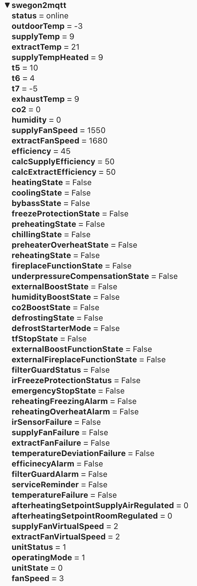

# swegon2mqtt

Parse raw UDP messages from Swegon Casa ventilation system RS-485 bus format and publish values to MQTT broker.

Tested with Swecon Casa W100 model, but should be compatible to all Casa models which use Premium control panel. 

MQTT explorer screenshot:



## Environament variables

See commonn environment variables from [MQTT-Framework](https://github.com/paulianttila/MQTT-Framework).

| **Variable**                 | **Default** | **Descrition**                                                                                                |
|------------------------------|-------------|---------------------------------------------------------------------------------------------------------------|
| CFG_APP_NAME                 | swegon2mqtt | Name of the app.                                                                                              |
| CFG_UDP_PORT                 | 9999        | UDP port to listen.                                                                                           |
| CFG_MSG_THROTTLE_TIME        | 5           | Message throttle time in seconds. Can be used to limit incoming message parsing.                              |
| CFG_CACHE_TIME               | 300         | Cache time in seconds for Swegon values. During cache time, values are only updeted to MQTT if value changed. |
| CFG_ANALYZER_MODE            | False       | Show diff between received messages.                                                                          |


### Example data

Simulate real data by sending raw UDP message from commandline

```bash
echo -en "\xCC\x64\x85\xFD\x0A\x13\x71\x00\xA0\xFD\x09\x15\x09\x0A\x04\xFB\x09\x00\x00\x9B\xA8\x2D\x00\x00\x00\x04\x97" | nc -4u -w1 localhost 9999
echo -en "\xCC\x64\x85\xFD\x0A\x18\x73\x00\xA0\x00\x00\x14\x00\x21\x00\x0A\x00\x00\x01\x00\x00\x02\x02\x01\x01\x00\x00\x00\x00\x07\x01\x49" | nc -4u -w1 localhost 9999
echo -en "\xCC\x64\x85\xFD\x0A\x0B\x21\x01\xA0\x01\x00\x00\x03\x0A\x04\x00\x00\x8C\x17" | nc -4u -w1 localhost 9999

```

```log
[2023-02-25 11:06:16,745] DEBUG in app: Received data (type=<class 'bytes'>): b'CC6485FD0A137100A0FD0915090A04FB0900009BA82D0000000497'
[2023-02-25 11:06:16,747] INFO in app: outdoorTemp = -3
[2023-02-25 11:06:16,748] INFO in app: supplyTemp = 9
[2023-02-25 11:06:16,749] INFO in app: extractTemp = 21
[2023-02-25 11:06:16,749] INFO in app: supplyTempHeated = 9
[2023-02-25 11:06:16,750] INFO in app: t5 = 10
[2023-02-25 11:06:16,752] INFO in app: t6 = 4
[2023-02-25 11:06:16,753] INFO in app: t7 = -5
[2023-02-25 11:06:16,754] INFO in app: exhaustTemp = 9
[2023-02-25 11:06:16,755] INFO in app: co2 = 0
[2023-02-25 11:06:16,758] INFO in app: humidity = 0
[2023-02-25 11:06:16,759] INFO in app: supplyFanSpeed = 1550
[2023-02-25 11:06:16,760] INFO in app: extractFanSpeed = 1680
[2023-02-25 11:06:16,762] INFO in app: efficiency = 45
[2023-02-25 11:06:16,765] INFO in app: calcSupplyEfficiency = 50
[2023-02-25 11:06:16,766] INFO in app: calcExtractEfficiency = 50

[2023-02-25 11:11:29,172] DEBUG in app: Received data (type=<class 'bytes'>): b'CC6485FD0A187300A00000140021000A00000100000202010100000000070149'
[2023-02-25 11:11:29,174] INFO in app: heatingState = False
[2023-02-25 11:11:29,175] INFO in app: coolingState = False
[2023-02-25 11:11:29,176] INFO in app: bybassState = False
[2023-02-25 11:11:29,178] INFO in app: freezeProtectionState = False
[2023-02-25 11:11:29,179] INFO in app: preheatingState = False
[2023-02-25 11:11:29,180] INFO in app: chillingState = False
[2023-02-25 11:11:29,181] INFO in app: preheaterOverheatState = False
[2023-02-25 11:11:29,183] INFO in app: reheatingState = False
[2023-02-25 11:11:29,184] INFO in app: fireplaceFunctionState = False
[2023-02-25 11:11:29,185] INFO in app: underpressureCompensationState = False
[2023-02-25 11:11:29,185] INFO in app: externalBoostState = False
[2023-02-25 11:11:29,189] INFO in app: humidityBoostState = False
[2023-02-25 11:11:29,190] INFO in app: co2BoostState = False
[2023-02-25 11:11:29,190] INFO in app: defrostingState = False
[2023-02-25 11:11:29,192] INFO in app: defrostStarterMode = False
[2023-02-25 11:11:29,193] INFO in app: tfStopState = False
[2023-02-25 11:11:29,195] INFO in app: externalBoostFunctionState = False
[2023-02-25 11:11:29,196] INFO in app: externalFireplaceFunctionState = False
[2023-02-25 11:11:29,197] INFO in app: filterGuardStatus = False
[2023-02-25 11:11:29,197] INFO in app: irFreezeProtectionStatus = False
[2023-02-25 11:11:29,198] INFO in app: emergencyStopState = False
[2023-02-25 11:11:29,198] INFO in app: reheatingFreezingAlarm = False
[2023-02-25 11:11:29,199] INFO in app: reheatingOverheatAlarm = False
[2023-02-25 11:11:29,199] INFO in app: irSensorFailure = False
[2023-02-25 11:11:29,199] INFO in app: supplyFanFailure = False
[2023-02-25 11:11:29,199] INFO in app: extractFanFailure = False
[2023-02-25 11:11:29,200] INFO in app: temperatureDeviationFailure = False
[2023-02-25 11:11:29,200] INFO in app: efficinecyAlarm = False
[2023-02-25 11:11:29,201] INFO in app: filterGuardAlarm = False
[2023-02-25 11:11:29,202] INFO in app: serviceReminder = False
[2023-02-25 11:11:29,202] INFO in app: temperatureFailure = False
[2023-02-25 11:11:29,203] INFO in app: afterheatingSetpointSupplyAirRegulated = 0
[2023-02-25 11:11:29,203] INFO in app: afterheatingSetpointRoomRegulated = 0
[2023-02-25 11:11:29,203] INFO in app: supplyFanVirtualSpeed = 2
[2023-02-25 11:11:29,204] INFO in app: extractFanVirtualSpeed = 2
[2023-02-25 11:11:29,204] INFO in app: unitStatus = 1

[2023-02-25 11:11:50,120] DEBUG in app: Received data (type=<class 'bytes'>): b'CC6485FD0A0B2101A0010000030A0400008C17'
[2023-02-25 11:11:50,121] INFO in app: operatingMode = 1
[2023-02-25 11:11:50,121] INFO in app: unitState = 0
[2023-02-25 11:11:50,122] INFO in app: fanSpeed = 3
 ```

## Example docker-compose.yaml

```yaml
version: "3.5"

services:
  swegon2mqtt:
    container_name: swegon2mqtt
    image: paulianttila/swegon2mqtt:2.0.0
    restart: unless-stopped
    environment:
      - CFG_LOG_LEVEL=DEBUG
      - CFG_MQTT_BROKER_URL=127.0.0.1
      - CFG_MQTT_BROKER_PORT=1883
      - CFG_CACHE_TIME=300
      - CFG_MSG_THROTTLE_TIME=5
      - CFG_ANALYZER_MODE=False
    ports:
      - "9999:9999/udp"
    healthcheck:
      test: ["CMD", "curl", "-f", "http://localhost:5000/healthy"]
      interval: 60s
      timeout: 3s
      start_period: 5s
      retries: 3
 ```

 # Swegon RS-485 Bus and frame format information

RS-485 to Ethernet converters can be used to listening raw data from RS-485 bus and send data as UDP datagrams to swegon2mqtt.

Tested via cheap USR-TCP232-24 RS-485 to Ethernet converter from Jinan USR IOT Technology Limited.

 ## Serial settings

 * Speed: 38400
 * Data bits: 8
 * Parity: none
 * Stop bits: 1


 ## Frame format
 ```
 +----+----+-----+-----+-------+-------+-----+----+-------+
 | CC | 64 | <D> | <S> | <CMD> | <LEN> |  <DATA>  | <CRC> |
 +----+----+-----+-----+-------+-------+-----+----+-------+
      |<----------- HEADER ----------->|
                                       |<- LEN -->|
      |<----------------- CRC ------------------->|   
```
## CRC checksum

CRC-CCITT (0xFFFF)

https://www.lammertbies.nl/comm/info/crc-calculation.html
